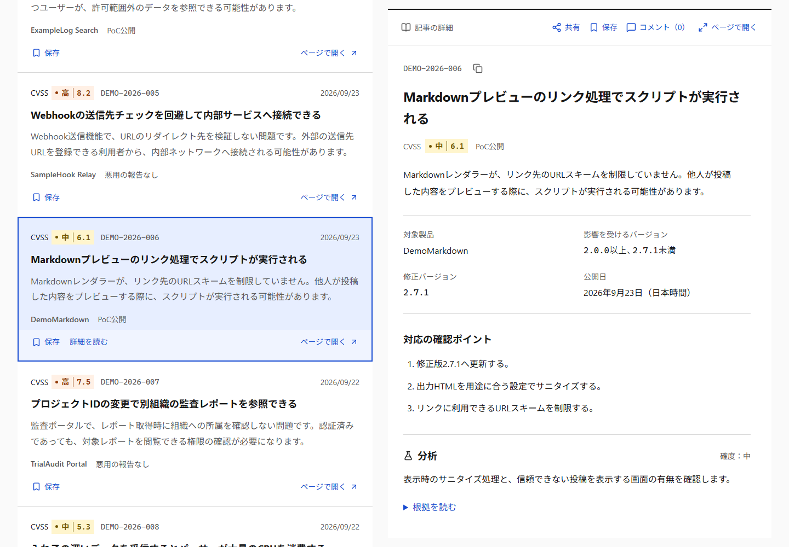
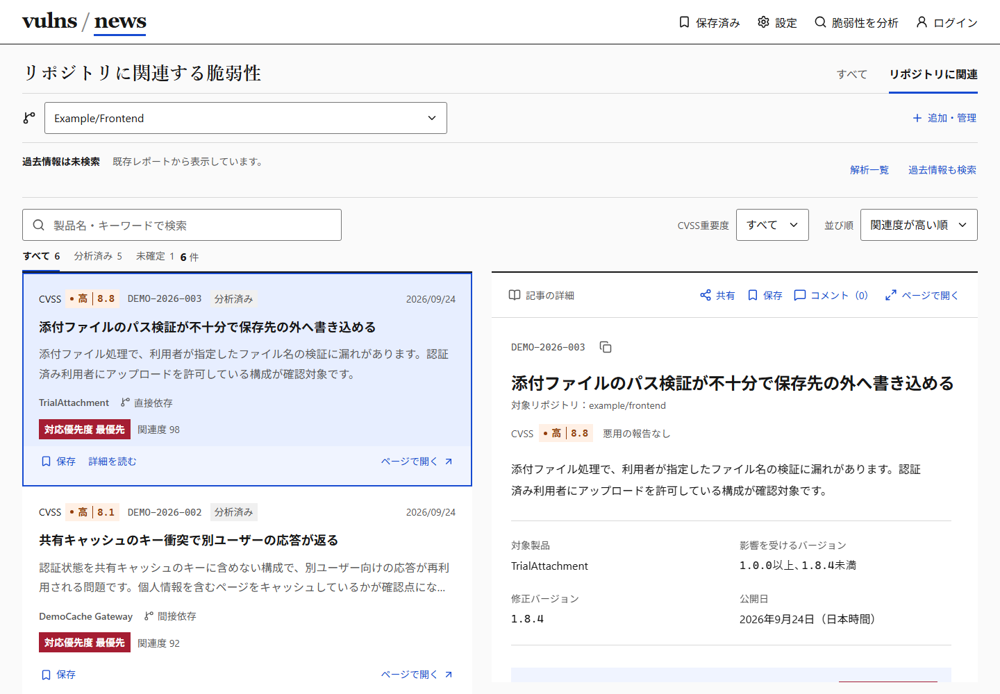

# フロントエンドのレビュー案内

このフロントエンドは、採用した画面案を基に実APIへ接続していく実装の土台です。未接続部分をローカル処理で動かし、未合意の機能も検討用に残しています。コードの不具合と、機能を採用するかの判断を分けてレビューします。

## まず見るもの

1. [レビュー後の修正状況](frontend-review-followup.md): 今回の修正、確認手順、未解決事項。初回の検証記録は [品質レビューと再検証](frontend-quality-review.md)
2. [DESIGN.md](../DESIGN.md): 色、文字、情報の優先順位、スクロールと画面幅のルール
3. [API連携メモ](frontend-integration.md): 現在のGo APIで確認できること、これから合意すること

最新の修正を動かす場合は `codex/frontend-review-completion` を使い、[起動手順](../frontend/README.md) に従ってください。このブランチには下の差分をすべて含みます。

## PRを読む順番

| 順番 | PR | 比較先 | 見てほしいこと |
| --- | --- | --- | --- |
| 1 | [#3 画面と操作の基準版](https://github.com/K3NLatte/vulns-news/pull/3) | main | 画面全体、必要な機能、UIとデータ処理の分離 |
| 2 | [#12 入力・保存・解析依頼の検証](https://github.com/K3NLatte/vulns-news/pull/12) | codex/frontend-mock | URL、破損データ、保存失敗、件数制限、取消 |
| 3 | [#13 状態管理・画面操作の修正](https://github.com/K3NLatte/vulns-news/pull/13) | codex/frontend-hardening | セッション復元、複数タブ、応答検証、遷移とキーボード |
| 4 | [#14 設計・ブラウザーテスト・CI](https://github.com/K3NLatte/vulns-news/pull/14) | codex/frontend-quality | DESIGN、検証資料、ブラウザーテスト、CI、実APIとの差 |

2026-09-25に確認した時点で、前回の修正 #16 は #14 のブランチへ取り込み済みです。今回の `codex/frontend-review-completion` は、その先端 `943babc` を比較先とする追加修正です。まず今回のPRの対応表・変更点を確認し、画面全体の背景が必要な場合に上のPRへ戻ってください。既存PRの履歴は書き換えません。

各PRは一つ前のブランチを比較先にしています。GitHubの **Files changed** には、その段階で追加した差分だけが出ます。基準版を後続PRで何度も読み直す必要はありません。#3自体は大きいため、画面と責務を把握したうえで、下記の順序で読み進めてください。

quantumshiro（Nakanishi Hiro）とK3NLatte（Ken）へレビューを依頼します。マージ・自動マージは行いません。採用が決まった段階で、比較先の変更や依存順の取り込み方法をチームで決めます。後続PRを先にmainへ取り込もうとすると前段の変更も含まれるので、PRの比較先を確認してください。

## コードを読む順番

| 対象 | ファイル | 確認すること |
| --- | --- | --- |
| 画面用のデータ | `frontend/src/types/` | CVSS、関連度、対応優先度、未評価の区別 |
| 取得境界 | `services/localFeedLoader.ts`、`services/feedContract.ts`、`composables/useFeed.ts` | 実行時検証、応答順逆転、中止、不正データからの再試行 |
| 入力と保存 | `utils/publicUrl.ts`、`services/workspace.ts` | 正規化、上限、プロフィールの分離、復元、保存失敗・競合 |
| 解析の状態 | `services/reports.ts`、`services/reportSession.ts`、`composables/useReportLibrary.ts` | 重複・中止・期限・新着反映・保存参照 |
| 操作と画面 | `App.vue`、`components/`、`composables/useNavigation.ts`、`useReadingPosition.ts`、`useFeedPanes.ts` | 遷移、選択、入力エラー、フォーカス、スクロール |
| 回帰試験 | `src/**/*.test.ts`、`frontend/e2e/` | 実際に壊れたケースを守れているか、境界の不足はないか |

## 画面で確認する流れ

- 一般フィードを下へスクロール → 記事を選択 → ページ表示 → 戻る。左一覧の位置とフォーカスを確認。
- 設定で `https://github.com/example/frontend` と `https://github.com/example/backend` を登録 → 切替 → 関連度順、未確定、CVSSと対応優先度を比較。
- 記事を保存・コメント → プロフィールへ移行 → 再読み込み → ログアウト。追加したCVEの記事は新しいセッションでも保存参照から復元できることを確認。
- 解析依頼 → 中止・再試行 → 期限切れレポートの再分析。手動更新と追跡再開を区別。
- キーボードだけで検索クリア、記事選択、共有、入力エラー、削除確認、ログインダイアログの終了を試す。
- 狭い画面、200%文字、長いID、`?scenario=error`、`?scenario=empty`、`?view=mvp` を確認。

不具合の指摘は「操作・入力・期待した結果・実際の結果・対象ファイル」を添えてください。画面の好みや未合意の仕様は、変更したい目的を添えると検討しやすくなります。

## 実画面

2026-09-25、ローカルのサンプルデータで撮影。PCは1440×1000、スマホは390×844です。実データの分析結果ではありません。

一覧を下まで読み進めても、右の記事を同じ画面内で読めます。

リポジトリの影響はCVSSとは別に表示します。

[スマホの記事画面](screenshots/article-mobile.png)

### 継続チェックと整形

`frontend/` では `pnpm lint` で TypeScript、Vue の essential ルール、Vue のアクセシビリティ推奨ルールを確認する。型の整合性は `pnpm typecheck`、操作後のフォーカスや通知はブラウザーテストで確認する。Lint だけで操作性や全てのアクセシビリティ要件を保証するものではない。入力境界の制御文字検出に限って `no-control-regex` を除外している。

整形は変更対象を指定して `pnpm format src/components/対象.vue` で実行できる。一括整形で機能差分を埋めないため、今回の修正では既存の全ファイルを整形し直していない。CI は依存関係の監査、Lint、型チェック、単体テスト、ビルド、開発用・本番成果物のブラウザーテストを実行する。パッケージマネージャーと Node の範囲は package.json に明記している。

設定は [eslint-plugin-vue の公式ガイド](https://eslint.vuejs.org/user-guide/)、[Vue のアクセシビリティ Lint ガイド](https://vue-a11y.github.io/eslint-plugin-vuejs-accessibility/)、[Prettier の設定ガイド](https://prettier.io/docs/configuration) を参照。

2026-09-25 の確認では、GitHub 公式 API のリリースとタグのコミットを照合して [checkout v7.0.1](https://github.com/actions/checkout/releases/tag/v7.0.1)、[pnpm/action-setup v6.1.0](https://github.com/pnpm/action-setup/releases/tag/v6.1.0)、[setup-node v7.0.0](https://github.com/actions/setup-node/releases/tag/v7.0.0)、[upload-artifact v7.0.1](https://github.com/actions/upload-artifact/releases/tag/v7.0.1) を SHA で固定した。各 action.yml の Node 24 ランタイムと使用入力を確認し、ランナーは `ubuntu-24.04` とした。pnpm のバージョンは `frontend/package.json` から読み、キャッシュは setup-node の1か所で管理する。GitHub 上での実行結果は該当コミットの CI で別途確認する。
